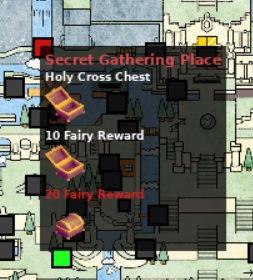

# Map integration

This document describes the requirements to add a map tab to UT. UT uses the [Poptracker](https://github.com/black-sliver/PopTracker/tree/master) specifications for the content of the map tab.

The intent of UT's map tab is to allow world devs to start making a poptracker pack before logic settles into a more stable configuration, however there's enough benefits to UT's integrated tab that it might be worth adding support even if the world already has a dedicated poptracker pack.

## The Basics of adding a map page

By defining a dict with the following fields, the world informs UT that a poptracker pack should be loaded

```py
from typing import ClassVar

class MyWorld(World):
    tracker_world: ClassVar = {
        "map_page_folder" : <Name of the folder inside the apworld that has all of the poptracker files in it, used for internal poptracker packs>
        "external_pack_key" : <optional string that is the name of the setting string that UT reads in order to find the external pop tracker pack, takes priority over internal packs>
        "map_page_maps" : <Location(s) of the maps.json file(s) relative to the root folder of the pack, may be a list if more then one file exists>
        "map_page_locations" : <Location(s) of the locations.json file(s) relative to the root folder of the pack, may be a list if more then one file exists>
        "map_page_setting_key" : <optional tag that informs which data storage key will be watched for auto tabbing>
        "map_page_index" : <optional function that will control the auto tabbing>
        "poptracker_name_mapping" : <optional Dict that maps the poptracker pack names to the location id as they exist in the datapackage >
        "location_setting_key" : <optional data storage key used to determine where to place the location indicator>
        "location_icon_coords" : <optional function used to convert between the map and the value in data storage into coords>
    }
```

The setting key values have two special keys that UT will replace with the correct values in run time (because the struct needs to be a static class var)

 * `{player}` : replaced with the external player slot number  
 * `{team}` : replaced with the external team number (almost always going to be 1)  

 *Note*: These are not f string values, these are literal string values on the world side

 The contents of maps.json and locations.json are the same as poptracker format with the exception that all logic is derived from UT's internal world, and the location names must match exactly with AP location names. With the obvious exception that access and visability rules are handled by UT and can be safely ommited.

 ## Internal pack defintion

 For internal packs, simply embedding the poptracker pack into the apworld and defining the folder path from the root module inside of `map_page_folder`

 ```
Game.apworld
-game
--tracker
---maps
----maps.json
---locations
----locations.json
--__init__.py
 ```
 ```py
    "map_page_folder":"tracker",
    "map_page_maps":"maps/maps.json",
    "map_page_locations":"locations/locations.json",
```

## External pack definition

for `external_pack_key` you can define the setting like this, this should point to a zipped poptracker pack
```py
from settings import FilePath
class UTPackPath(FilePath):
    required = False #You can comment this to force users to have the poptracker map

...
    #inside the settings group definition
    ut_pack_path : Union[UTPackPath, str] = UTPackPath()

```

If the key resolves to "" then the user will be prompted to select the pack, if they fail to select one the map tab won't be rendered.
If the key resolves to None then the user won't be prompted and the map won't be rendered

```
Tracker_Pack.zip
-maps
--maps.json
-locations
--locations.json
```

```py
    "external_pack_key": "ut_pack_path",
    "map_page_maps":"maps/maps.json",
    "map_page_locations":"locations/locations.json",
```

## Implementing Auto tabbing

UT can support automatically changing the loaded map tab via data storage keys, to do so you need to define the key in `map_page_setting_key` who's value will be passed to the function defined in `map_page_index`

`map_page_index` is a function with the following template

```py
def map_page_index(data: Any) -> int:
    #do code here
    return 0
```

The function has the task to convert the value retrieved from datastorage and convert that into the index in the maps.json that should be loaded. Because of the free-form nature of datastorage it is difficult to have a good general example, as the values will be dependent on what the client has access to.

## Mapping values from an existing poptracker to AP Location names

UT's poptracker implementation assumes that the lowest level name for the location (called section in poptracker) matches exactly a location name in AP. For packs being developed for UT this isn't a concern, however for packs that already exist this is an assumption that simply might not be true.

To support this, UT allows for worlds to create a mapping dict that will be used to convert pop section paths to AP Location names

`poptracker_name_mapping` can be defined with the following template

```py

poptracker_name_mapping: dict[str,int] = {
    #These entries are the lowest TWO section names to allow for generic final names identified by the group name
    "Secret Gathering Place/Holy Cross Chest" : 123456,
}
```


Locations will first check if they match a key in the mapping before the literal name matching allowing for some locations to be mapped, while others are just simple matching

## Current Location icon implementation

UT also supports rendering an icon based on a datastorage key, that the world can choose to implement that can be used to show where the player is on the current map

`location_icon_coords` can be defined with the following template, and will be passed in the current map tab index and the content of the datastorage value under `location_setting_key` 

```py
def location_icon_coords(index: int, data: Any) -> tuple[int, int, str] | None
    #do code here
    return x_coord, y_coord, internal_path_to_icon
```

The coordinates returned are relative to the map page itself. The icon path to be loaded is relative to the pack definition in either `external_pack_key` or `map_page_folder`

If either the y or x coord are returned as negative, or if the function returns None, the icon will be hidden